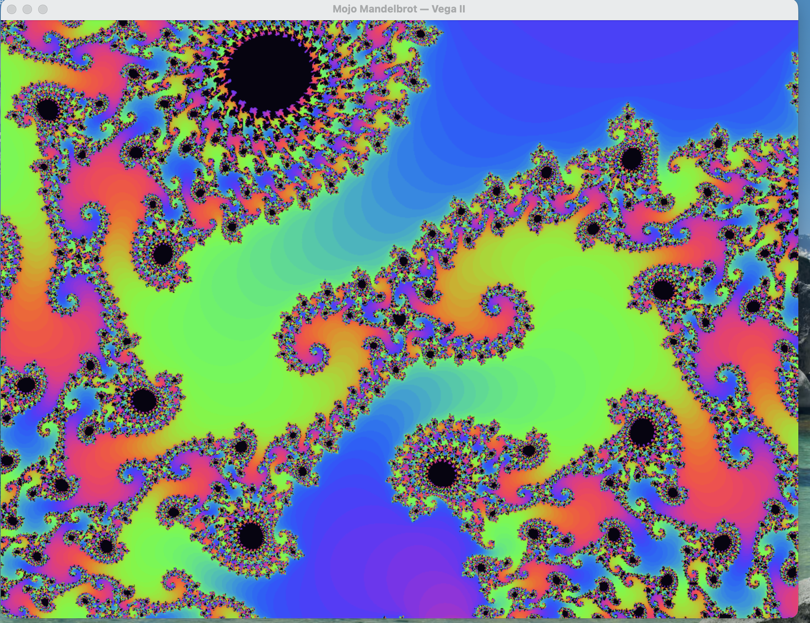
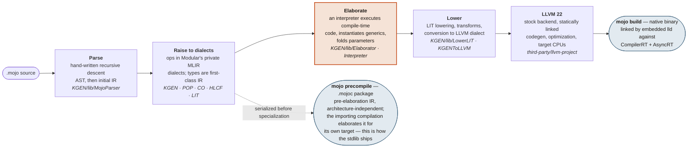
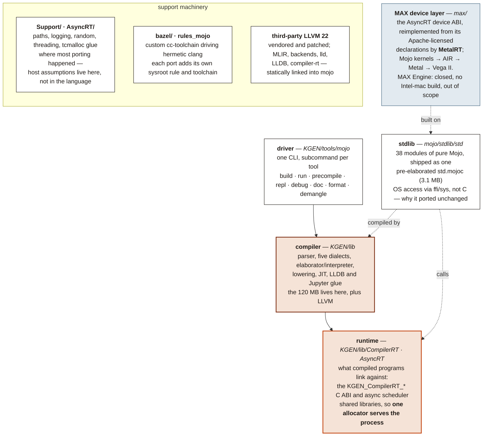

# MojoMacX64 — Mojo for Intel Macs with AMD GPUs, via Metal

**A personal-computer port of Mojo: the compiler and standard library, built to
run natively on hardware we own, using the operating-system features and the
specific accelerators that machine actually has.**

Mojo's premise is that one source file should specialise to whatever silicon
you point it at. These repositories take that premise literally and aim it at
ordinary personal computers — not a server, not a cloud instance, not a Linux
VM standing in for the real thing, but the machine on the desk. Each port
targets one host, one CPU, and one accelerator, and each is described the same
way: what runs, what does not, and what has merely been built rather than
tested.

## Acknowledgements

Mojo is a serious piece of language engineering, and Modular open-sourced the
compiler and the standard library under Apache 2.0 with LLVM exceptions — a
patent grant, no field-of-use restriction, and no hardware limits on the
source. That decision is what makes work like this both legal and possible:
you can take the source, aim it at hardware its authors never targeted, and
find out what happens. Not much of the industry gives you that.

It is worth being precise about how much it bought. These ports are not
rewrites; they are hooks into extension points that were deliberately left
public — target registries, the elaborator, the device ABI. Against a closed
compiler most of this would not have been a long job, it would have been an
impossible one.

Thanks to Chris Lattner and the team at Modular who designed and built Mojo,
and to everyone who has contributed to the compiler and the standard library
since. All original design credit is theirs. The mistakes in these ports are
ours.

Upstream is [modular/modular](https://github.com/modular/modular). If you want
supported Mojo, use [the real thing](https://mojolang.org) on a platform
Modular ships for.

## What this is

**A permanent fork of [modular/modular](https://github.com/modular/modular),
frozen at commit `577b6b839e` (2026-08-21 — Mojo `1.1.0.dev2026082105`), that
brings the Mojo language and its GPU programming stack to hardware upstream
never targeted.**

- **Host:** Intel x86-64 macOS, built on and for the Mac Pro 2019
- **GPU:** AMD Radeon Pro Vega II 32 GB, programmed through Metal's low-level
  IR (AIR) — the same path the upstream compiler uses for Apple Silicon GPUs
- **Cocoa:** the compiler reads the macOS SDK at compile time, so AppKit and
  Metal calls are type-checked against the real SDK rather than hand-written
  bindings



*A native macOS app in Mojo: a live-zooming Mandelbrot at 60fps where both the
escape iteration and the colour are Mojo kernels on the Vega II — no shader
anywhere — presented through an NSWindow whose every AppKit and Metal call is
type-checked against the SDK at compile time. See
[`spikes/mandelbrot/`](spikes/mandelbrot/).*

**Mojo only.** This fork covers the Mojo compiler, standard library,
`DeviceContext` GPU runtime, and the open `max/kernels` library. The MAX Engine
(graph compiler, `libmax`, the Python inference stack) is closed-source, has no
Intel-mac build, and is out of scope.

> [!IMPORTANT]
> This is not a Modular product and is not affiliated with, endorsed by, or
> supported by Modular or Apple. Please do not file issues, discussions or
> support requests with Modular, or on the upstream repository, for anything
> you build or break here — nothing in this tree is theirs to answer for. The
> AIR backend and the GPU runtime in particular are this fork's own code. It
> carries no warranty and does not accept contributions. See
> [An experiment, not a product](#an-experiment-not-a-product).

## The ports

Five machines, five ports, one language. Each row is a separate
repository. They share an ancestor and most of their tree, and differ in
host architecture, in which accelerator runtime is active, and in how far
each has been pushed — so the row for one is not evidence for another.
Where a claim in this README rests on work done in a sibling repository,
it says so.

| Port | Host | Reference hardware | Accelerator path | Where it stands |
| --- | --- | --- | --- | --- |
| [**WINMOJO**](https://github.com/albanread/WINMOJO) | Windows 11 ARM64<br/>`aarch64-pc-windows-msvc` | Qualcomm Oryon (Snapdragon X)<br/>Adreno X1-45 | Mojo → SPIR-V → OpenCL,<br/>via `dragonrt` | `mojo build` and `mojo run` both work; lldb builds and debugs Mojo binaries; Adreno Mandelbrot at 11–13 ms/frame; 258 of 369 stdlib test targets pass |
| [**maxdragon**](https://github.com/albanread/maxdragon) | Windows 11 ARM64<br/>`aarch64-pc-windows-msvc` | Qualcomm Oryon (Snapdragon X)<br/>Adreno X1-45 · Hexagon NPU | Mojo → SPIR-V → OpenCL,<br/>via `dragonrt`; the NPU through QNN at graph level, outside Mojo | `mojo build` works; the JIT is not enabled on this branch; the Adreno acceptance test passes and Mandelbrot runs at 16 ms/frame against 250 ms on one CPU core; the Hexagon reaches 4.1× the CPU on gigabyte-scale graphs; 258 of 369 stdlib test targets pass |
| [**WINMOJOX64Blackwell**](https://github.com/albanread/WINMOJOX64Blackwell) | Windows 11 x64<br/>`x86_64-pc-windows-msvc` | Intel Core Ultra 9 285H<br/>NVIDIA RTX PRO 2000 Blackwell (`sm_120a`) | Mojo → PTX → `nvcuda.dll`,<br/>via `nvptxrt` | `mojo build` and `mojo run` both work; TMA, CUDA graphs, completion flags and host callbacks all tested on hardware; REPL and LLDB packaged; no systematic SM120a kernel census yet |
| [**MojoMacX64**](https://github.com/albanread/MojoMacX64) ← *you are here* | macOS x86-64<br/>Mac Pro 2019 | Intel x86-64<br/>AMD Radeon Pro Vega II 32 GB (gfx906) | Mojo → AIR → Metal,<br/>via `MetalRT` | Cocoa apps build and run; `msg_send` materialised to C speed (3660 ns → 3 ns); a Mandelbrot at 60fps whose escape iteration *and* colour are Mojo kernels on the Vega II; wave64 matmul lands 3.4× on prefill; a Mojo editor written in Mojo |
| [**MojoCocoa**](https://github.com/albanread/MojoCocoa) | macOS ARM64<br/>Apple Silicon | Apple M4<br/>Apple GPU, 10 cores | Mojo → AIR → Metal<br/>(ported, never compiled) | **Newest, and not working yet.** The Cocoa compiler hook and `std.objc` pass 9 of 9 spikes and the example apps build, but the Apple Silicon GPU stack is ported source that has never been through a compiler |

None of these is finished, and none of them is trying to become the official port of anything.

## An experiment, not a product

This repository is an experiment. It exists so that one person could find out
whether Mojo could be made to run — properly, natively, with a real GUI and a
real GPU — on a Mac that upstream does not target, and could record honestly
what happened. That is the whole of it.

Stated plainly, so that nothing here is taken for more than it is:

- **It does not accept contributions.** There is no contributor guide, no CLA,
  no code of conduct and no review process, because there is no project here
  for anyone to join. Pull requests will not be reviewed. The upstream
  contribution documents that came with the fork have been deleted rather than
  left in place to imply otherwise. A change that Mojo itself should have
  belongs [upstream](https://github.com/modular/modular), not here.
- **It does not claim to be complete.** The kernel library has not been swept
  for wave64 assumptions end to end, `simdgroup_matrix` and bfloat16 are
  absent on this hardware, and the AMD Metal backend has produced silent
  miscompiles that are documented rather than fixed. The journal is the claim
  being made, and it is deliberately unflattering.
- **It does not claim to be correct.** Every measurement was taken on one
  machine, by one person, and is reported as observed. Where a result was
  later found to be wrong, the correction is in the journal next to the
  original rather than replacing it.
- **It is not supported and will not be.** No releases, no roadmap, no
  packages, no obligation to keep working — and by design, no tracking of
  upstream after the fork point.

Reading it, building it, or taking ideas from it is exactly what the licence
permits and you are welcome to all three. Just don't mistake it for a product,
a distribution, or a community.

## Fixed at this release, forever

This fork never rebases on, merges, or tracks upstream. The fork point
is the whole point: a known-good snapshot of the open-sourced compiler,
tuned for this hardware until the machine stops working. Hardcoding for
x86-64 Darwin and gfx906 is a feature, not a bug.

## Notes for others: AIR on AMD GPUs

Targeting Apple's AIR for an **AMD GPU through Metal** is close to
undocumented territory. [AIR_on_AMD.md](AIR_on_AMD.md) collects what we
learned doing it — the public reverse-engineering record digested and
credited, plus everything we measured on real hardware: why AMD's Metal
plugin crashes on generic pointers (and where the crash log is), the
address-space trap that CUDA-shaped frontends walk into, AIR's real
type-mangled runtime symbols, the LLVM-vintage constructs that break the
bitcode writer, bugs in the vendored downgrade writer itself, and which
tools lie to you. Written to be useful even if you never touch Mojo.

### The understanding turned out to be portable

That knowledge was built to make Mojo emit AIR. It transferred, unchanged, to a codebase with
nothing to do with Mojo: llama.cpp's Metal backend, which compiles and runs on these cards
without a single error message and produces semantically garbage tokens.

The same faults were already in the field guide before that work started — 64-lane wavefronts
against kernels written for 32, absent `simdgroup_matrix`, and Apple's Metal compiler for AMD
miscompiling `uint64 x short` so the short lands in the high word. A 32-lane intrinsic applied
to a 64-lane wavefront had been found and fixed in this compiler backend first; the same
disease in another codebase was recognised rather than discovered.

The result is [IntelMacLlamaCpp](https://github.com/albanread/IntelMacLlamaCpp): a Mac Pro
(2019) running Qwen3-30B-A3B at 179 t/s prefill and 52 t/s generation, and Gemma-4-26B at
241 / 49, verified correct against the CPU backend rather than merely eyeballed. Upstream
produces garbage on the same hardware.

It is recorded here because it is the strongest available evidence that this port is real
work rather than a claim. Understanding a GPU at instruction-selection level is unfalsifiable
on its own; carrying that understanding into an unrelated codebase and making a 30B model run
correctly on hardware everyone says to replace is a demonstration of it.

## Python interop needs a Python newer than macOS ships

`std.python` calls `Py_NewRef`, which arrived in **CPython 3.10**. macOS ships
3.9, so against the system Python any Mojo program that touches Python aborts:

```
ABORT: symbol not found: Py_NewRef
```

That is not a gap in this fork — it is the system Python being too old. The
SDK wrapper (`vega-sdk/bin/mojo`) points Mojo at a newer interpreter:

```bash
brew install python@3.12
/usr/local/opt/python@3.12/bin/python3.12 -m venv vega-sdk/pyenv
vega-sdk/pyenv/bin/pip install -r vega-sdk/python-requirements.txt
```

The wrapper then sets `MOJO_PYTHON_LIBRARY` to Homebrew's
`libpython3.12.dylib`, `PYTHONHOME` to that framework, and puts
`vega-sdk/pyenv`'s `site-packages` on `PYTHONPATH`. Each is overridable: export
`MOJO_PYTHON_LIBRARY` yourself and the wrapper defers to it.

The venv exists because Homebrew's Python is
[PEP 668](https://peps.python.org/pep-0668/) externally-managed, so installing
into it directly is refused; a venv is the clean answer rather than
`--break-system-packages`. It is gitignored — rebuild it with the commands
above.

With that in place the stock examples work, including the pygame one:

```bash
cd mojo/examples/life && ../../../vega-sdk/bin/mojo run lifev2.mojo
```

## High-level plan

Full design with file-level detail: [PORT_DESIGN.md](PORT_DESIGN.md).

> [!NOTE]
> This section is the original plan, kept because it explains the shape of the
> work and why each front was bounded the way it was. Much of it has since
> landed — the host port, the AIR trio, the Metal runtime, and the Cocoa work
> that was listed as merely "also intended" are all real and running, and the
> Mandelbrot at the top of this README is the end-to-end proof. Treat the
> phases below as the route that was taken rather than a to-do list, and
> [`MacVegaFork_journal.md`](MacVegaFork_journal.md) as the record of where it
> actually went.

**Front A — host port (x86-64 macOS).** The compiler builds from source
and LLVM's X86 backend is already enabled; the port is a bounded list of
arm64 assumptions: target-triple hardcodes in the bazel toolchain,
aarch64-only hermetic tool downloads (Python, uv, linters), a gRPC
patch, and severing the arm64-only binary wheel.

**Front B — Vega II via Metal AIR.** The macOS Metal driver compiles
AIR → GCN at pipeline creation, so no GPU instruction selector is
needed. The compiler's AIR hooks and bitcode machinery are open, but the
AIR backend itself is not published — we write a small "AIR trio"
(traits/lowering/backend) into the open target registries, the same
bounded shape our Windows sibling proved with its SPIR-V trio. Then:

1. **MetalRT** — reimplement the closed device-runtime C ABI
   (`AsyncRT_*`) over the open in-tree AsyncRT framework: CPU device
   first to validate semantics, then a Metal device (command queues,
   blit copies, pipeline cache) for the Vega II.
2. **Target entry** — a `MetalVega2` GPU definition: wave64
   (`warp_size=64` vs Apple's 32), 64 CUs, 64 KB LDS, discrete-memory
   semantics (private storage + explicit DMA, no unified-memory
   zero-copy).
3. **Feature gating** — no `simdgroup_matrix`, no bfloat16, Metal 3
   tier; fp16 fast paths stay on.
4. **Kernel triage** — sweep `max/kernels`, fix wave64 assumptions,
   fall back where Apple-only features are used; benchmark against MPS.

**Also intended — Cocoa + Unix, automated.** Make Mojo great at Cocoa:
comptime metadata queries (`cocoakb_query`) evaluated by the compiler
against [CocoaBaseMCP](https://github.com/albanread/CocoaBaseMCP)'s
SQLite mirror of the Objective-C surface — checked struct layouts,
constants, selectors, and per-signature x86-64 `objc_msgSend` variant
selection, with no hand-maintained bindings. Includes a no-leak memory
design: RAII retain/release, autorelease-pool scoping, zeroing weak
references for cycles, and leak-checked golden tests. See
[PORT_DESIGN.md](PORT_DESIGN.md) §10.

**Phases.** 0: de-risk spikes (Metal smoke test on the Vega II, native
build attempt) → 1: native x86-64 toolchain, CPU tests green → 2:
runtime ABI over CPU device → 3: first kernel end-to-end on the Vega II
(Mojo → AIR → metallib → dispatch) → 4: kernel library triage →
5: tune for gfx906 and freeze.

## Technical notes and journals

This README is the summary. The working record — including the corrections —
lives in the journal, and the GPU device work has its own write-up.

### The port itself

| Document | What it covers |
| --- | --- |
| [`MacVegaFork_journal.md`](MacVegaFork_journal.md) | The day-by-day record: each defect, its root cause, and what was tried before the fix. Where a result was later found wrong, the correction sits next to the original rather than replacing it. |
| [`PORT_DESIGN.md`](PORT_DESIGN.md) | The full design with file-level detail — both fronts, the host port and the GPU. |
| [`COCOA_DESIGN.md`](COCOA_DESIGN.md) | The Cocoa hook: comptime metadata queries, dispatch, ownership, and the no-leak memory design. |
| [`MOJO_MAC_PLAYGROUND_DESIGN.md`](MOJO_MAC_PLAYGROUND_DESIGN.md) | The native editor and REPL, written in Mojo. |

### AMD Radeon Pro Vega II — the GPU device port

Targeting Apple's AIR for an **AMD GPU through Metal** is close to undocumented
territory, and this is the document to read even if you never touch Mojo.

| Document | What it covers |
| --- | --- |
| [`AIR_on_AMD.md`](AIR_on_AMD.md) | The public reverse-engineering record digested and credited, plus everything measured on real hardware: why AMD's Metal plugin crashes on generic pointers and where the crash log is, the address-space trap a CUDA-shaped frontend walks into, AIR's real type-mangled runtime symbols, the LLVM-vintage constructs that break the bitcode writer, bugs in the vendored downgrade writer itself, and which tools lie to you. |

Two silent miscompiles on the AMD Metal backend are recorded in the journal
rather than fixed, along with the wave64 matmul that had to be written without
intrinsics because of them.

---

# Anatomy of Mojo

*What one large compiler binary actually contains, how a `.mojo` file becomes
machine code, and where the runtime, standard library and MAX fit around it —
as found in the source tree during these ports.*

| | |
| --- | --- |
| **1** | binary: `mojo` — driver, parser, compiler, JIT, REPL, LSP |
| **120 MB** | `mojo` itself, with LLVM + MLIR statically inside |
| **5** | private MLIR dialects (KGEN, POP, CO, HLCF, LIT) |
| **38** | stdlib modules, pure Mojo, zero C in the library itself |
| **322** | stdlib test files |

## Part I — What Mojo is

Mojo is a systems programming language wearing Python's syntax. Functions,
structs, traits and generics compile to native code with no interpreter and no
GC, and ownership and borrow semantics do the memory management. Older writing
about Mojo describes a Python-style `def` coexisting with a systems-style `fn`;
that is no longer true at this version, which rejects `fn` with *"'fn' has been
removed; use 'def' instead"*. It was built by Modular as the language for
writing AI kernels — code that must run on CPUs, GPUs and accelerators from one
source — and that origin explains its two defining traits.

First, it is **MLIR-native**. Where most languages lower their AST to LLVM IR
directly, Mojo parses into Modular's own MLIR dialects and does nearly all of
its work — metaprogramming, generics, optimisation — as MLIR transformations.
LLVM only sees the final, fully-specialised result.

Second, **compile-time execution is the metaprogramming system**. There is no
separate template or macro language: `@parameter` code, generic instantiation
and constant evaluation all run in a built-in interpreter that executes the
same IR the compiler is building. Types are values at compile time.

The consequence is the unusual shape of the distribution: one large binary
containing a full compiler stack, plus a small runtime the generated code calls
into, plus a standard library written entirely in Mojo itself.

## Part II — From source to machine code



JIT variants of the same pipeline back `mojo run` and the REPL
(`KGEN/lib/ExecutionEngine`).

**Why the elaborator is the hot stage:** generic instantiation by compile-time
interpretation is what lets one kernel source specialise for any target, and it
is why a `.mojoc` is portable while a `.o` is not. It is also why the compiler
needs its runtime present at build time — compile-time code allocates through
the same `KGEN_CompilerRT` ABI that compiled programs use at run time.

## Part III — How the repository composes



**The shape every one of these ports discovered:** the language is portable and
the *substrate* is not. The standard library reaches the OS through `ffi`/`sys`
rather than C, which is why it moves to a new platform almost unchanged; the
host assumptions that had to be fixed live in `Support/`, `AsyncRT/` and the
Bazel toolchain. And the device layer is the one genuinely missing piece —
Modular publishes the API a kernel calls and the declarations of the ABI
underneath it, but not an implementation for hardware they do not ship for.
Each port here writes its own.

## Licence and attribution

The Mojo compiler (`KGEN/`), the C++ substrate, and the standard library are
licensed Apache 2.0 with LLVM exceptions, and this fork inherits that licence.
Everything added here carries the same licence.

This tree contains files under more than one licence. Read the root
[LICENSE](LICENSE), the [Licenses/](Licenses/) directory, the third-party
notices, and the licence header of each source file before redistributing a
build.

`LICENSE` and `Licenses/` are kept exactly as upstream has them, deliberately:
almost every file here is still Modular's Apache-2.0 code, a derivative work
has to ship the licence with it, and the same grant is what puts this fork's
own additions on a clear footing.

No Modular binary, wheel, or account has been used in this work. Everything
here is built from the published Apache-licensed source, and where a device
runtime was needed it was implemented against the published ABI rather than
extracted from a binary.

Upstream is [modular/modular](https://github.com/modular/modular). All
original design credit belongs to Modular.

I am not a lawyer, and nothing here is legal advice.
